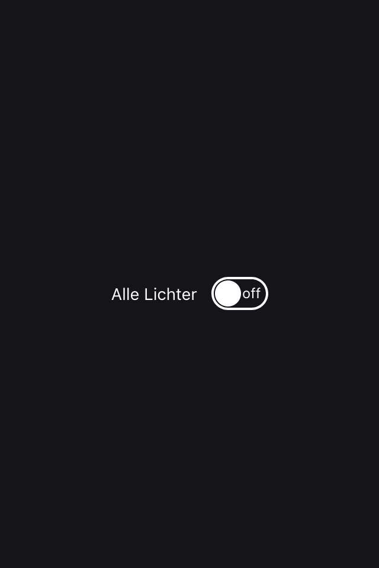
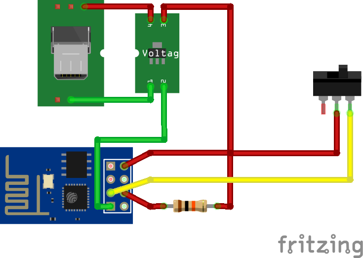

# Bändeltoggle

Toggle lights with a Bändel. Requires [Connect Alexa to RC Switches](https://github.com/tilmanjusten/alexa-rc-switch).

## Features

- Old school fashioned light toggle
- Webinterface
- API: 
    - Switch device via GET requests
    - Get device state via GET request
- Over the air updates
- Website resources on SPIFFS

## Development

Requires assembled hardware ([see below](#Hardware)) and [PlatformIO](https://platformio.org).

1. Create ``src/secret.h`` from ``src/secrects.template.h``
1. Set SSID and password of your WLAN and over the air hostname
1. Update ``URL_HOST`` depending on your infrastructure
1. First deploy only: 
    1. Comment out ``upload_port`` and ``upload_port`` in ``platform.io`` 
    1. Plug device to FTDI adapter
1. Flash device via OTA update/FTDI adapter
1. Upload web resources to SPIFFS

### Dependencies

Required libraries:

- ArduinoOTA
- SHA-1 Hash
- ESP Async WebServer

## Deployment

See (development section above)[#Development].

## Hardware

### Parts

- ESP8266 (ESP-01)
- Voltage Regulator (AMS1117)
- USB Micro Plug
- Pull switch
- 220&#8486; Resistor
- Wires
- Plastic case
- USB cable (USB A to micro)
- Power supply (1A)

### Wiring

[See Fritzing Sketch](docs/Wiring.fzz).

